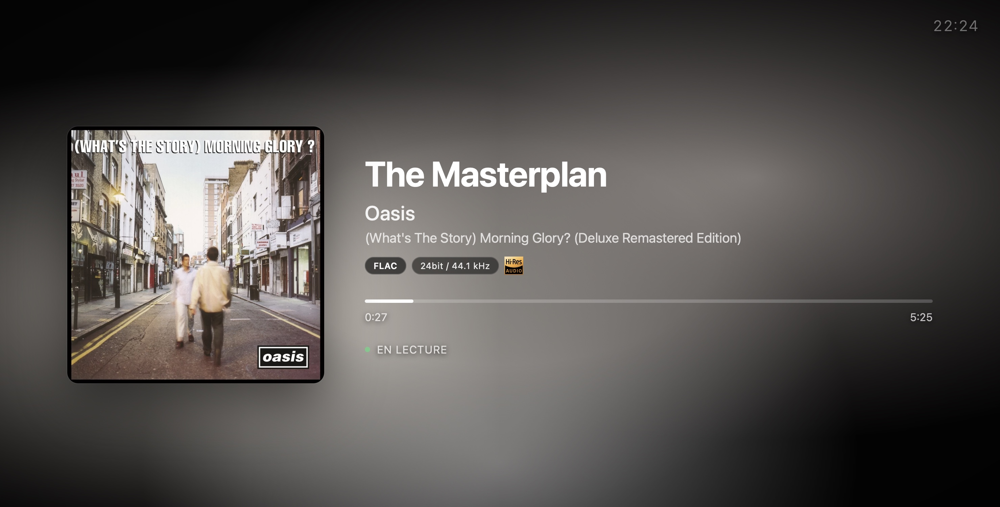

# nowplaying



Fullscreen Now Playing page for MPD. Shows the current track with a dynamic background gradient pulled from the album art, audio quality badges, and Hi-Res detection.

No nginx required - the bridge serves everything on port 8766.

## What it looks like

- Background gradient extracted from the album art colors
- Album art via Last.fm
- FLAC / bit depth / sample rate badges
- Hi-Res Audio logo for anything >= 88.2 kHz or >= 24 bit
- Progress bar, elapsed and total time
- Scrolling marquee for long titles
- Dimmed overlay when paused
- Clock in the top right corner

## Requirements

- MPD
- Python 3
- A Last.fm API key - free at https://www.last.fm/api

## Getting started
```bash
git clone https://github.com/MAT-GRC/nowplaying.git
cd nowplaying
pip install python-mpd2 requests
export LASTFM_API_KEY=your_key_here
python mpd-bridge.py
```

Then open http://localhost:8766 in a browser.

For the French version: http://localhost:8766/index.fr.html or http://localhost:8766?lang=fr

## Environment variables

| Variable | Default | Description |
|----------|---------|-------------|
| LASTFM_API_KEY | required | Your Last.fm API key |
| ALSA_CARD | 0 | ALSA card number for audio format detection |
| MPD_HOST | 127.0.0.1 | MPD host |
| MPD_PORT | 6600 | MPD port |

Copy `.env.example` to `.env` and fill in your values.

## Docker

A `docker-compose.yml` is included. Set `LASTFM_API_KEY` in the environment section and run:
docker compose up -d

## License

MIT
